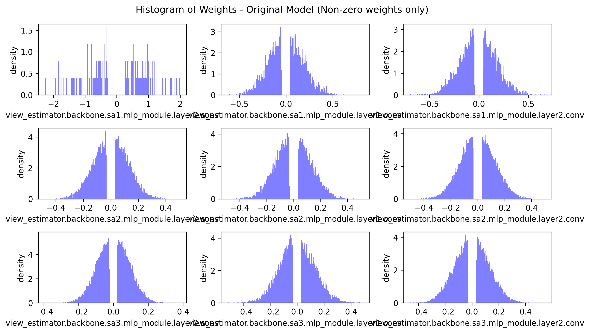
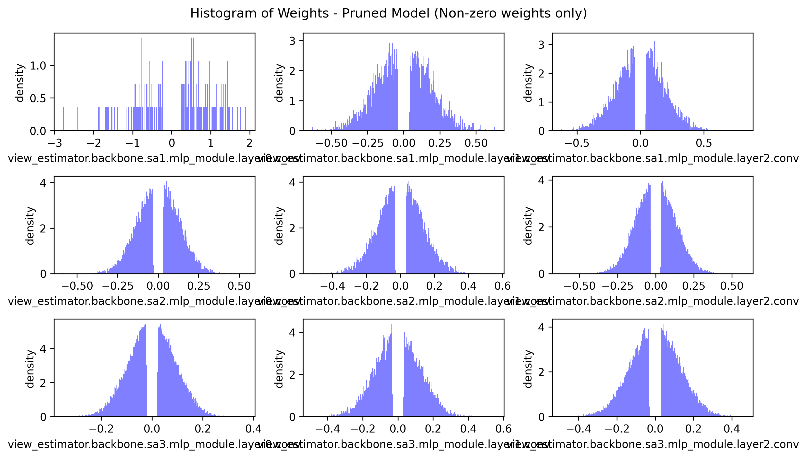

# distributed-deep-learning-final-project
2024-2 빅데이터기반 분산-딥러닝 혁신 프로젝트  
프로젝트 제목: Distributed Training을 통한 GraspNet 모델 학습 속도 향상  
학과: SW융합대학 컴퓨터공학과  
이름: 이철민  

원본 Git Repo:
- https://github.com/graspnet/graspnet-baseline.git

## Requirements
본 프로젝트는 Ubuntu 20.04.6 LTS, CUDA 11.3 버전에서 진행되었습니다.
- Python 3
- PyTorch 1.6
- Open3d >=0.8
- TensorBoard 2.3
- NumPy
- SciPy
- Pillow
- tqdm

## Installation
1. conda 가상환경 생성
```
conda create -n graspnet python==3.7.9
conda activate graspnet
```
2. git clone
```
https://github.com/Asimofe/ddl-final-project.git
cd ddl-final-project
```
3. pip를 통해 packages 설치
```
pip install -r requirments.txt
```
4. PointNet2, knn 연산자 컴파일 및 설치
```
cd pointnet2
python setup.py install

cd ../knn
python setup.py install
```
5. evaluation을 위한 graspnetAPI 설치
```
cd ..
git clone https://github.com/graspnet/graspnetAPI.git
cd graspnetAPI
pip install .
```
6. Dataset 설치  
다음 링크를 참고하여 설치
- https://graspnet.net/
7. Tolerance label 생성
```
cd dataset
sh command_generate_tolerance_label.sh
```
## Train and evaluate
1. Pruning 적용 전 모델 학습
```
bash command_train.sh
```
2. Pruning 적용 후 모델 학습
```
bash command_train_pruned.sh
```
3. Pruning 적용 전 모델 평가
```
bash command_eval_origin.sh
```
4. Pruning 적용 전 모델 평가
```
bash command_eval_pruned.sh
```
5. 모델 희소성, 파라미터 수, 모델 크기 분석
```
python metric_check.py
```

## 프로젝트 설명
GraspNet은 그리퍼(gripper)가 장착된 로봇팔(robotic arm)을 사용하여 복잡한 장면에서의 물제 grasp 문제를 해결하기 위한 학습데이터와 평가기준의 부재를 해결하기 위해  
97,280개의 RGB-D 이미지와 10억개 이상의 grasp pose를 포함한 대규모 데이터셋과 통합 평가 시스템을 제공한다.  

제안된 네트워크는 point cloud를 입력으로 하여 grasp pose 예측하며 접근 방향과 동작 매개변수를 분리하여 학습하고,  
grasp 견고성을 높이기 위해 새로운 grasp affinity field를 설계하였다.  

이 모델은 PoineNet을 백본으로 사용하고 있으며 구조는 다음과 같다.  


학습 시 L1 Unstructed Pruning을 적용하여 모델 경량화를 진행해보고 적용하지 않았을 때와 성능을 비교해본다.  


## 결과
### L1 Unstructed Pruning 적용 전 0이 아닌 weight 분포

Activation function으로 ReLU를 사용하기 때문에 Pruning을 적용하기 전이여도 이와같은 형태를 보이는 것으로 생각된다.


### L1 Unstructed Pruning 적용 후 0이 아닌 weight 분포  


